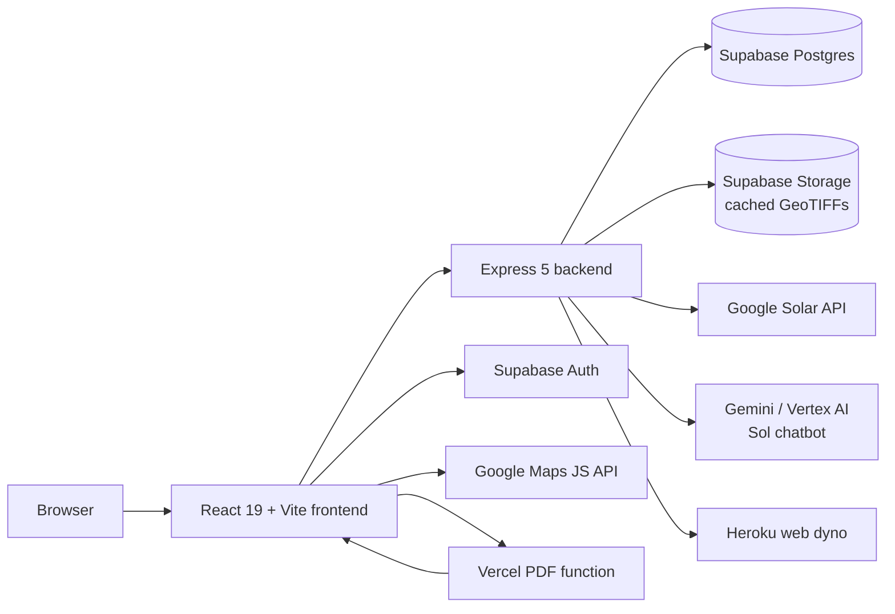
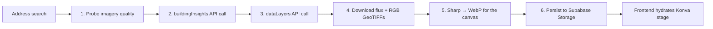
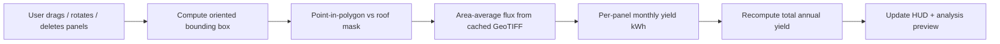
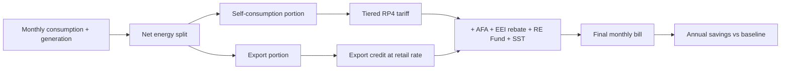

```mermaid
flowchart LR
    User[User opens Sol panel] --> Composer[Composer + cooldown gate]
    Composer --> Post[POST /api/projects/:id/chat]
    Post --> Auth[Supabase JWT auth]
    Auth --> Guard[Prompt-injection + length guard]
    Guard --> Project[(Load Project + Location<br/>from Postgres)]
    Project --> Digest[Render page-aware digest<br/>workbench or analysis]
    Digest --> Bible[Load knowledge bible<br/>Malaysian solar primer]
    Bible --> Prompt[Build layered system prompt<br/>language · persona · rules · primer · digest]
    Prompt --> Client[GenAI client<br/>Vertex AI → API-key fallback]
    Client --> Gemini[Gemini streamGenerateContent]
    Gemini --> SSE[SSE token stream]
    SSE --> Frontend[Stream + render markdown]
    Frontend --> Chips[Sample follow-up chips<br/>from chat.json pool]
    Frontend -.client disconnect.-> Abort[AbortController cancels Gemini call]
```

<div align="center">


# SolarSim

### Rooftop solar in three steps, grounded in real Malaysian tariffs.

_Search a roof. Tweak the layout. Get a NEM-accurate savings report. As easy as **A-B-C**._

<br/>

<p>
  
  
  
  
  
  
  
  
  
  
</p>

<p><strong>Aligned with the UN Sustainable Development Goals</strong></p>

<p>
  
</p>

<br/>


</div>

---

> **Final Year Project at Asia Pacific University** · Built by **[@AlaskanTuna](https://github.com/AlaskanTuna)**.

> [!NOTE]
> SolarSim is an **assessment** tool. It produces an estimate report, not a quotation, not a contract, and not an installation order. Final pricing and feasibility always come from a licensed Malaysian installer.

---

## ✨ At a Glance

<table>
  <tr>
    <td align="center"><strong>3 pages</strong><br/><sub>Map → Workbench → Analysis, end to end</sub></td>
    <td align="center"><strong>~90s</strong><br/><sub>average time from address to first savings projection</sub></td>
    <td align="center"><strong>RP4 + EEI + AFA + RE Fund</strong><br/><sub>full TNB tariff stack post-July 2025</sub></td>
  </tr>
</table>

---

## 🖼 Screenshots

<table>
  <tr>
    <td width="33%"><p align="center"><sub><strong>Landing.</strong> <em>Marketing site, pricing, and FAQ.</em></sub></p></td>
    <td width="33%"><p align="center"><sub><strong>Dashboard.</strong> <em>Greeting, quick actions, and recent projects.</em></sub></p></td>
    <td width="33%"><p align="center"><sub><strong>Projects.</strong> <em>Saved projects with status and workflow guide.</em></sub></p></td>
  </tr>
  <tr>
    <td width="33%"><p align="center"><sub><strong>Map.</strong> <em>Search any Malaysian address and lock in the rooftop.</em></sub></p></td>
    <td width="33%"><p align="center"><sub><strong>Workbench.</strong> <em>Drag, rotate, and shape the panel layout.</em></sub></p></td>
    <td width="33%"><p align="center"><sub><strong>Analysis.</strong> <em>NEM bill simulation, payback, and PDF export.</em></sub></p></td>
  </tr>
</table>

---

## 🧠 What SolarSim Does

### The Problem

Malaysian homeowners interested in rooftop solar have limited access to quick, data-driven preliminary assessments. Existing options are either manual on-site surveys (expensive and slow) or generic online calculators that lack roof-specific data. There is no tool that lets users see a proposed panel layout on _their actual rooftop_, interactively adjust it, and immediately understand the financial impact under Malaysia's NEM Rakyat 3.0 scheme.

### Project Objectives

1. **Investigate** rooftop characteristics and solar energy potential using Google Solar API's geospatial data as a basis for reducing reliance on manual assessments.
2. **Design and develop** a web-based tool that auto-generates preliminary panel layouts, enables interactive modification, and incorporates Malaysian tariff and NEM parameters.
3. **Evaluate** the system's usability, accuracy, and effectiveness through user feedback and comparison with existing methods.

### Target Users

| User Type     | Description                                                                    |
| ------------- | ------------------------------------------------------------------------------ |
| **Primary**   | Malaysian homeowners exploring rooftop solar installation                      |
| **Secondary** | Solar installers using the tool for quick preliminary assessments with clients |

User assumptions: non-technical, unfamiliar with solar terminology, accessing via desktop browser (primary) or mobile browser (secondary).

---

## 🏗 Feature Matrix

|     | Feature                       | What it means                                                                                                                                             |
| --- | ----------------------------- | --------------------------------------------------------------------------------------------------------------------------------------------------------- |
| 🛰  | **Solar API Pipeline**        | One Solar API call per address, results cached forever. Building insights, monthly flux, and DSM/RGB GeoTIFFs are persisted in Supabase Storage.          |
| 🖼  | **GeoTIFF Re-sampling**       | Panel moves never re-hit the Solar API. Flux is re-sampled locally from the cached GeoTIFF using point-in-polygon over each panel's rotated OBB.          |
| 🎨  | **Konva Canvas Workbench**    | React-Konva stage with pan, zoom, marquee select, free-rotate, snap-align, undo/redo, and an irradiance-direction amber glow for the chosen month.        |
| 💡  | **Roof-Aware Layout Presets** | Tell SolarSim your monthly bill and savings goal; it right-sizes panel count and orientation. Skippable, so power users get the maximum-coverage view.    |
| 💰  | **NEM Rakyat 3.0 Engine**     | Self-consumption + export simulation, EEI banding, AFA monthly variation, SST and RE Fund. Implemented as a typed billing engine with 36 unit tests.      |
| 📈  | **Lifecycle Mode**            | Switch from simple payback to a 25-year lifecycle view: degradation, tariff escalation, scheduled inverter swaps, and annual maintenance.                 |
| 🌐  | **i18n (EN / MS / ZH)**       | Three fully-translated locales including all tariff explainers, with locale-aware Intl number/date formatting (`zh-Hans-MY` for the demo audience).       |
| 🎭  | **Theme + A11y**              | Light / dark / system theme persisted via `next-themes`, glassmorphic UI primitives, full keyboard support on the canvas, and visible focus rings.        |
| 📄  | **Sandboxed PDF Export**      | Heroku backend signs a 60-second token; a separate Vercel function navigates a headless Chromium to a print route and ships the A4 landscape PDF.         |
| 🔐  | **Supabase Auth**             | Email/password and Google OAuth, with per-user quota enforcement, project-level RLS, and remember-email on sign-in.                                       |
| 💬  | **Sol Chatbot Assistant**     | Project-aware chat grounded in your project's data and a curated solar knowledge bible. Streams over SSE, page-aware, EN/MS/ZH, prompt-injection guarded. |

---

## 🌏 Why It Matters: SDG Alignment

SolarSim is built around one product stance: **Malaysian homeowners should be able to make a data-driven solar decision without first surrendering their phone number to an installer.** That stance maps directly to one UN Sustainable Development Goal:

| SDG                                                                    | Goal                            | How SolarSim contributes                                                                                                                                                                         |
| ---------------------------------------------------------------------- | ------------------------------- | ------------------------------------------------------------------------------------------------------------------------------------------------------------------------------------------------ |
|  | **Affordable and Clean Energy** | Lowering the friction between curiosity and a real solar quotation accelerates household adoption. Every projection cites tariff schedules so the upside number is verifiable, not sales-pitchy. |

---

## 🏛 Architecture

SolarSim is a three-tier monorepo: a **React 19 + Vite SPA**, an **Express 5 + Prisma backend**, and a **Vercel Puppeteer microservice** for PDF rendering. Supabase backs auth, Postgres, and the GeoTIFF object store.



<details>
<summary><strong>Solar Pipeline: Address to Editable Roof</strong></summary>



</details>

<details>
<summary><strong>Workbench Edit Loop: Zero Solar API Calls</strong></summary>



</details>

<details>
<summary><strong>NEM Billing Engine: Per-Month Bill Comparison</strong></summary>



</details>

<details>
<summary><strong>Sol Chatbot: Project-Grounded SSE Pipeline</strong></summary>



</details>

---

## 🧰 Tech Stack

| Category        | Technology                                                                   | Notes                                                           |
| --------------- | ---------------------------------------------------------------------------- | --------------------------------------------------------------- |
| Frontend        | React 19 · Vite 6 · TypeScript 5 · Tailwind CSS 4 · shadcn/ui · lucide-react | SPA with React Router, TanStack Query, framer-motion            |
| Canvas & 3D     | Konva 9 · react-konva · @react-three/fiber · @react-three/drei               | Workbench stage, snap alignment, panel-model 3D preview         |
| Charts & DnD    | Recharts 3 · @dnd-kit/core · @dnd-kit/sortable                               | Analysis charts, sortable hero card layout                      |
| i18n & Theming  | i18next · react-i18next · next-themes                                        | en / ms / zh, light / dark / system theme                       |
| Backend         | Express 5 · TypeScript 5 · Prisma 6 · Zod                                    | REST API, validators, typed Supabase access                     |
| Geo & Imagery   | geotiff.js · sharp · proj4                                                   | GeoTIFF parsing, raster → WebP, lat-lng ↔ pixel reprojection    |
| Identity & Data | Supabase (Auth + Postgres + Storage)                                         | Email/password + Google OAuth, RLS-backed projects              |
| External APIs   | Google Solar API · Google Maps JavaScript API · Geocoding API                | One Solar call per address, cached forever                      |
| Chat & GenAI    | @google/genai (Gemini / Vertex AI) · SSE-over-POST streaming                 | Sol assistant with project-grounded prompts, dual-auth fallback |
| Testing         | Vitest · @testing-library/react · jsdom                                      | Co-located unit tests, 205 passing                              |
| PDF Service     | Vercel function · Puppeteer · Chromium (headless)                            | Sandboxed off the Heroku dyno, signed-token access              |
| Deploy          | Heroku (web dyno) · Vercel (PDF function) · GitHub Actions CI/CD             | `pnpm` build on Heroku via `heroku-postbuild`                   |

---

## 🚀 Getting Started

This section walks a fresh clone end-to-end: local dev → cloud provisioning → first production deploy. Reproducible from a clean machine in ~30 minutes if you have CLIs installed, ~60 minutes from zero.

> [!IMPORTANT]
> **CLI-first operations.** Every cloud platform here is configured via its CLI (`supabase`, `gcloud`, `gh`, `heroku`, `vercel`), not the dashboard. Dashboards are for read-only inspection (logs, metrics). Anything that creates, modifies, or deletes config goes through the CLI so it's reproducible, scriptable, agent-friendly, and easy to document.

### 1. Prerequisites

**Local toolchain:**

- **Node.js** `24.x` — [nodejs.org](https://nodejs.org)
- **pnpm** `10.33.0` — `corepack enable` (ships with Node 24)
- **git**

**Cloud Platform CLIs** (one-time install per machine):

```bash
# macOS / Linux examples — adjust per platform
brew install supabase/tap/supabase   # or scoop/winget on Windows
brew install --cask google-cloud-sdk  # gcloud
brew install gh                       # GitHub CLI
brew install heroku/brew/heroku
npm install -g vercel
```

**Cloud Accounts** (free tiers cover everything for this project):

- [Supabase](https://supabase.com) — Postgres + Auth + Storage
- [Google Cloud Console](https://console.cloud.google.com) — Solar API, Maps JS API, OAuth 2.0, optional Vertex AI for chat
- [Resend](https://resend.com) — transactional email (3,000/month free)
- [Heroku](https://heroku.com) — backend + bundled frontend (Basic dyno: $7/mo)
- [Vercel](https://vercel.com) — PDF render function (Hobby tier free)

Authenticate each CLI before starting:

```bash
supabase login
gcloud auth login
gh auth login
heroku login
vercel login
```

### 2. Clone and Install

```bash
git clone https://github.com/AlaskanTuna/solar-layout-generator.git
cd solar-layout-generator
corepack enable
pnpm install
cp .env.example .env   # fill in values per the table in §4
```

### 3. Provision Cloud Resources

Each cloud account needs a dedicated project/app for SolarSim. Do these in order — later steps depend on earlier values.

**3a. Google Cloud Project**

```bash
gcloud projects create solar-layout-generator --name="SolarSim"
gcloud config set project solar-layout-generator
gcloud services enable solar.googleapis.com maps-backend.googleapis.com geocoding-backend.googleapis.com
gcloud services enable aiplatform.googleapis.com   # for Sol chatbot via Vertex AI
```

Then in the Cloud Console (one-time, no CLI equivalent):

- **APIs & Services → Credentials → Create credentials → API Key** → name it `SolarSim Backend`. Restrict to the 3 enabled APIs above. Copy the key for `GOOGLE_API_KEY`.
- **APIs & Services → Credentials → Create credentials → OAuth client ID** → Application type: Web. Authorized redirect URI: `https://<your-supabase-ref>.supabase.co/auth/v1/callback` (you'll get the ref in step 3b). Copy `GOOGLE_OAUTH_CLIENT_ID` and `GOOGLE_OAUTH_SECRET`.

**3b. Supabase Project**

```bash
# Create the project via dashboard (no CLI for create yet); pick a region close to your users.
# Then back in the terminal:
supabase projects list                      # find the reference id of the new project
supabase link --project-ref <your-ref>      # links this repo to that project
```

In the Supabase dashboard → Settings → API, copy:

- `Project URL` → `SUPABASE_URL`
- `anon public` key → `SUPABASE_ANON_KEY`
- `service_role` key → `SUPABASE_SERVICE_ROLE_KEY`
- Settings → Database → Connection String (URI) → `SUPABASE_DATABASE_URL`

Create the storage bucket the backend writes GeoTIFFs to (the bucket name is hardcoded in `backend/src/services/storageService.ts` as `geotiffs`):

```bash
# In the dashboard: Storage → New bucket → name: geotiffs → Public: OFF.
# Or via SQL editor:
# insert into storage.buckets (id, name, public) values ('geotiffs', 'geotiffs', false);
```

**3c. Resend (Email Delivery)**

1. Sign up at [resend.com](https://resend.com) → API Keys → Create.
2. Copy the key for `RESEND_API_KEY` (only used by Supabase's SMTP relay; backend doesn't use it).
3. Optional: verify a custom domain (`Domains → Add`) for production-quality sender. Until then, the SMTP config uses `onboarding@resend.dev` as a pre-verified test sender.

### 4. Configure Environment Variables

Open `.env` and fill in every value below. Vars prefixed `VITE_` use `dotenv-expand` so they auto-derive from the canonical value (no duplicate paste).

| Variable                    | Required for                              | Source / How to get it                                                                                                                                                   |
| --------------------------- | ----------------------------------------- | ------------------------------------------------------------------------------------------------------------------------------------------------------------------------ |
| `GOOGLE_API_KEY`            | Solar API, Maps JS, Geocoding             | GCP Console → Credentials → API Key                                                                                                                                      |
| `GOOGLE_OAUTH_CLIENT_ID`    | "Sign in with Google"                     | GCP Console → Credentials → OAuth client ID                                                                                                                              |
| `GOOGLE_OAUTH_SECRET`       | "Sign in with Google"                     | Same OAuth client                                                                                                                                                        |
| `GOOGLE_CLOUD_PROJECT`      | Sol chatbot (Vertex AI mode, recommended) | GCP project ID, e.g. `solar-layout-generator`                                                                                                                            |
| `GOOGLE_CLOUD_LOCATION`     | Sol chatbot                               | Region for Vertex AI; `global` works                                                                                                                                     |
| `GEMINI_API_KEY`            | Sol chatbot (API-key fallback)            | [aistudio.google.com/apikey](https://aistudio.google.com/apikey) — at least one of `GOOGLE_CLOUD_PROJECT` or `GEMINI_API_KEY` is required or the backend refuses to boot |
| `CHAT_MODEL`                | Sol chatbot model                         | Defaults to `gemini-3.1-flash-lite-preview`; override to any Gemini model id                                                                                             |
| `SUPABASE_URL`              | Auth, DB, Storage                         | Supabase → Settings → API                                                                                                                                                |
| `SUPABASE_ANON_KEY`         | Frontend Supabase client                  | Same                                                                                                                                                                     |
| `SUPABASE_SERVICE_ROLE_KEY` | Backend Supabase client (privileged)      | Same — never expose to the browser                                                                                                                                       |
| `SUPABASE_DATABASE_URL`     | Prisma direct connection                  | Supabase → Settings → Database → Connection String                                                                                                                       |
| `SITE_URL`                  | Auth redirect base                        | `http://localhost:5173` for local; production URL for deployed                                                                                                           |
| `RESEND_API_KEY`            | Auth confirmation / reset emails          | Resend → API Keys                                                                                                                                                        |
| `FRONTEND_URL`              | Backend CORS allowlist                    | `http://localhost:5173` locally, custom domain in production                                                                                                             |
| `BACKEND_PORT`              | Local dev backend                         | Default `3001`, only override on conflict                                                                                                                                |
| `FRONTEND_PORT`             | Local dev frontend                        | Default `5173`, only override on conflict                                                                                                                                |
| `PDF_TOKEN_SECRET`          | PDF export signed-token HMAC              | Generate with `openssl rand -hex 32`                                                                                                                                     |
| `PDF_EXPORT_URL`            | Frontend → PDF function                   | Set after Vercel deploy in §6 (placeholder OK for local)                                                                                                                 |

### 5. Initialise the Database and Run Locally

```bash
pnpm prisma:generate              # generate the Prisma client
pnpm db:migrate                   # apply migrations to your Supabase Postgres
pnpm db:seed                      # seed Malaysian tariff config (tariff bands, EEI, AFA, RE Fund, SST)
pnpm dev                          # frontend on :5173, backend on :3001
```

> [!NOTE]
> `pnpm db:migrate` runs `prisma migrate dev` which is interactive — fine locally, but Heroku/CI must use `prisma migrate deploy` (see §7).

Visit `http://localhost:5173`. Sign up with a real email → confirmation email arrives via Resend → click the link → you're in.

### 6. Sync Supabase Auth Config and Email Templates

Auth redirect URLs, OAuth provider settings, custom SMTP, and the four email templates (signup confirm, password reset, invite, email change) live in `supabase/config.toml` and `supabase/templates/*.html`. They are NOT auto-deployed when you `git push` — you must push them via the CLI:

```bash
set -a && source .env && set +a && yes | supabase config push
```

The `set -a; source .env; set +a` exports every var so `env(VAR)` references in `config.toml` resolve correctly. The `yes |` auto-confirms the diff prompt.

Verify in Supabase dashboard → Authentication → SMTP Settings: Custom SMTP should be enabled with `smtp.resend.com:587`.

### 7. Useful Commands

| Command                  | Description                                                         |
| ------------------------ | ------------------------------------------------------------------- |
| `pnpm dev`               | Start frontend + backend concurrently                               |
| `pnpm dev:backend`       | Start backend only                                                  |
| `pnpm dev:frontend`      | Start frontend only                                                 |
| `pnpm build`             | Build all workspaces for production                                 |
| `pnpm test`              | Run frontend + backend unit tests                                   |
| `pnpm typecheck`         | Strict TS check across every package                                |
| `pnpm format`            | Run Prettier across the repo                                        |
| `pnpm prisma:generate`   | Regenerate the Prisma client (after `schema.prisma` edits)          |
| `pnpm db:migrate`        | Apply migrations interactively (local dev)                          |
| `pnpm db:migrate:deploy` | Apply migrations non-interactively (Heroku release, CI, recovery)   |
| `pnpm db:seed`           | Seed tariff config data                                             |
| `supabase config push`   | Sync `supabase/config.toml` + email templates to the hosted project |

---

## ☁ Deployment

The app ships as **two services**: the Heroku web dyno (frontend bundle + Express API) and a separate Vercel function for PDF rendering. Both must be deployed for the app to be fully functional.

### 1. Heroku (Frontend + API)

**First-time app creation:**

```bash
heroku create <your-app-name>                    # e.g. solarsim-prod
heroku buildpacks:set heroku/nodejs              # auto-detected, but explicit is safer
git remote -v                                    # confirm 'heroku' remote was added
```

**Set every config var** (Heroku injects them at build AND runtime; `VITE_*` vars get baked into the frontend bundle during `pnpm build`, so they MUST be set before the first deploy):

```bash
# Replace placeholders with real values from your .env
heroku config:set \
  GOOGLE_API_KEY="..." \
  GOOGLE_OAUTH_CLIENT_ID="..." \
  GOOGLE_OAUTH_SECRET="..." \
  GOOGLE_CLOUD_PROJECT="solar-layout-generator" \
  GOOGLE_CLOUD_LOCATION="global" \
  GEMINI_API_KEY="..." \
  CHAT_MODEL="gemini-3.1-flash-lite-preview" \
  SUPABASE_URL="https://<ref>.supabase.co" \
  SUPABASE_ANON_KEY="..." \
  SUPABASE_SERVICE_ROLE_KEY="..." \
  SUPABASE_DATABASE_URL="postgresql://..." \
  SITE_URL="https://solarsim.tech" \
  FRONTEND_URL="https://solarsim.tech" \
  APEX_DOMAIN="solarsim.tech" \
  PDF_TOKEN_SECRET="$(openssl rand -hex 32)" \
  PDF_EXPORT_URL="placeholder-update-after-vercel-deploy" \
  VITE_GOOGLE_API_KEY="..." \
  VITE_SUPABASE_URL="https://<ref>.supabase.co" \
  VITE_SUPABASE_ANON_KEY="..." \
  VITE_PDF_EXPORT_URL="placeholder-update-after-vercel-deploy"
```

**First deploy:**

```bash
git push heroku main
```

`heroku-postbuild` (in root `package.json`) runs `pnpm build` which compiles backend + bundles frontend. The dyno then starts via the `Procfile` (`web: pnpm start`).

**Database migrations run automatically on every deploy** via the `release:` phase in the `Procfile` (`pnpm db:migrate:deploy`). The first deploy will apply all migrations from `prisma/migrations/` to your Supabase Postgres before the web dyno starts. If a migration fails, the release fails and the dyno keeps the previous image — safe by design.

Seed the tariff config once (only needed on a fresh DB):

```bash
heroku run pnpm db:seed
```

Verify the app: `heroku open` → sign up → check Heroku logs (`heroku logs --tail`) for any boot errors.

### 2. Vercel (PDF Render Function)

```bash
cd services/pdf-service
vercel                                           # interactive first-time link, accept defaults
vercel env add ALLOWED_FRONTEND_ORIGIN production
# When prompted: paste your production app origin (no trailing slash, e.g. https://solarsim.tech)
vercel --prod                                    # deploys; prints the function URL
```

Copy the function URL, then update Heroku and re-deploy the bundle so the frontend picks up the real URL:

```bash
heroku config:set \
  PDF_EXPORT_URL="https://<pdf-service>.vercel.app" \
  VITE_PDF_EXPORT_URL="https://<pdf-service>.vercel.app"
git commit --allow-empty -m "chore: rebuild for pdf service url" && git push heroku main
```

The empty commit triggers a rebuild so the new `VITE_PDF_EXPORT_URL` gets baked into the frontend bundle.

### 3. CI/CD

`.github/workflows/ci-cd.yml` runs on pushes to `main`:

- Pull requests run `pnpm install`, `build`, and unit tests.
- Pushes to `main` re-run CI then deploy the passing commit to Heroku via the Heroku Git endpoint.

**Required GitHub repo secrets** (set via `gh secret set <name>` or the dashboard):

- `HEROKU_API_KEY` — `heroku auth:token` to retrieve
- `HEROKU_APP_NAME` — the Heroku app name from §1

### 4. Post-Deploy Checklist

- Sign up via the live URL → confirmation email arrives from Resend → click → land on `/dashboard`.
- Create a project → search a Malaysian address → confirm → workbench loads with panels.
- Open the analysis page → enter a monthly bill → results render.
- Open Sol chatbot → send a message → tokens stream in word-by-word.
- Export PDF → file downloads.

If any step fails, `heroku logs --tail` and `vercel logs <deployment>` are the first places to look.

> [!IMPORTANT]
> If the live URLs or commands drift, the `Procfile`, `heroku-postbuild` script in `package.json`, and `.github/workflows/ci-cd.yml` are the source of truth, not this README.

---

## 🔒 Disclaimers

> [!CAUTION]
> All figures in SolarSim are **estimates** based on satellite-derived flux data. Real-world generation and savings can differ by 10 to 15 percent or more depending on shading, soiling, inverter behaviour, and weather variance not captured in the input data.

- 🧾 **Tariff Provenance.** Every kWh figure traces back to gazetted Suruhanjaya Tenaga and TNB schedules. RP4 brackets, EEI bands, AFA, SST, and the RE Fund are seeded as typed config, not narrated by an LLM.
- 🛰 **Imagery Scope.** Rooftop imagery and flux rasters come exclusively from the Google Solar API and stay scoped to the user's project. SolarSim does not scrape, syndicate, or republish any third-party data.
- ⚖ **Layout Boundary.** The Workbench plans where panels could go, not whether they should. Purlin spacing, MCB sizing, inverter placement, and roof-load calculations are out of scope and remain the installer's responsibility.
- 🔑 **Data Ownership.** Supabase Row-Level Security scopes every project to its owner. Account deletion cascades and removes the user's projects, cached imagery, and saved analyses.
- 🛡 **PDF Token Security.** PDF exports use signed tokens that expire in 60 seconds and are scoped to a single project, so leaked URLs cannot be replayed by anyone else.

---

## 👤 Developer

<table align="center">
  <tr>
    <td align="center" width="220">
      <a href="https://github.com/AlaskanTuna"></a><br/>
      <strong>Adam</strong><br/>
      <a href="https://github.com/AlaskanTuna"><sub>@AlaskanTuna</sub></a><br/>
    </td>
  </tr>
</table>

---

## 📁 Project Structure

<details>
<summary><strong>Repository Layout</strong></summary>

```text
solar-layout-generator/
├── assets/                     # README screenshots and brand art
├── shared/                     # Shared TypeScript types (consumed by both sides)
├── frontend/                   # React 19 + Vite SPA
│   ├── public/                 #   Logos, landing hero, dashboard art, favicons
│   └── src/
│       ├── api/                #   Typed REST client (locations, projects, quota, tariff)
│       ├── components/         #   shadcn/ui, layout, workbench, analysis, pdf, dashboard
│       ├── hooks/              #   React hooks (auth, panels, workbench data, undo/redo)
│       ├── lib/                #   Billing engine, canvas transforms, snap-alignment, i18n
│       ├── locales/            #   en / ms / zh translation namespaces
│       └── pages/              #   Route page components (3-page MVP + dashboard suite)
├── backend/                    # Express 5 + Prisma API
│   └── src/
│       ├── config/             #   Env, Prisma, Supabase clients
│       ├── geo/                #   Coordinate transforms, flux sampler, OBB geometry
│       ├── middleware/         #   Auth, validation, rate-limit, error handler
│       ├── routes/             #   /locations, /projects, /tariff, /quota, /health
│       ├── services/           #   Solar API pipeline, location service, PDF token signer
│       └── app.ts              #   Express app composition
├── services/
│   └── pdf-service/            # Standalone Vercel + Puppeteer PDF function
├── prisma/
│   ├── schema.prisma           # Postgres schema (Location, Project, TariffConfig, Quota)
│   └── seed.ts                 # Seeds RP4 + EEI + AFA + RE Fund tariff defaults
├── supabase/
│   ├── config.toml             # Supabase project config (auth, email, OAuth)
│   └── templates/              # Branded auth email templates (en + ms + zh)
├── tests/
│   └── smoke/                  # Bash smoke tests (auth-z, end-to-end deploys)
├── .github/workflows/          # ci-cd.yml: CI + Heroku auto-deploy
├── package.json                # Root workspace orchestrator
├── pnpm-workspace.yaml
└── .env.example
```

</details>

---

<div align="center">

<sub><strong>SolarSim</strong> · © 2026 Adam ([@AlaskanTuna](https://github.com/AlaskanTuna))</sub>

</div>
