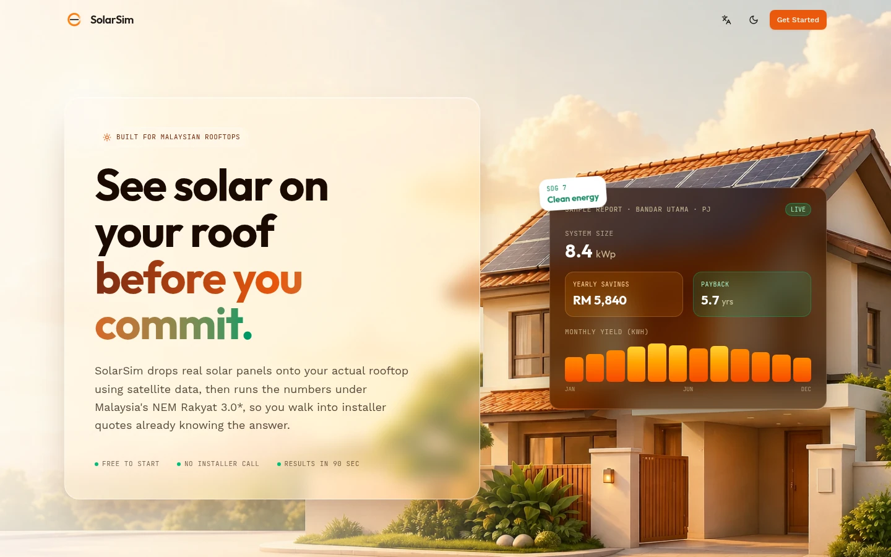
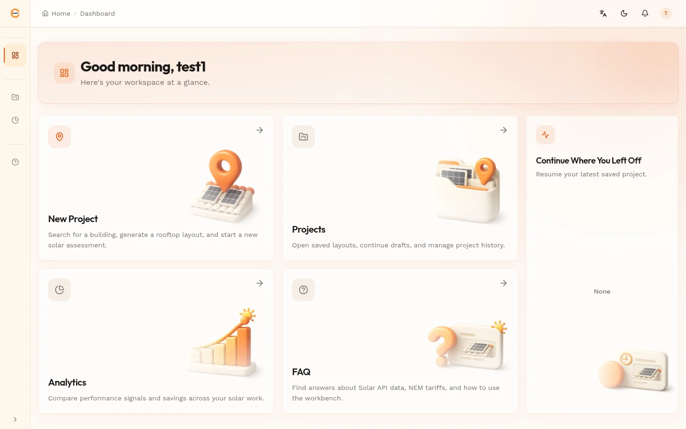
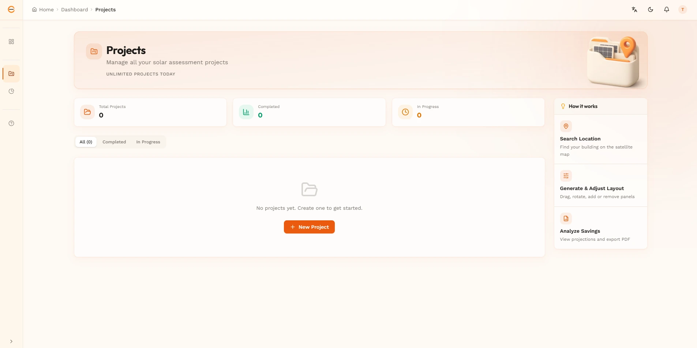
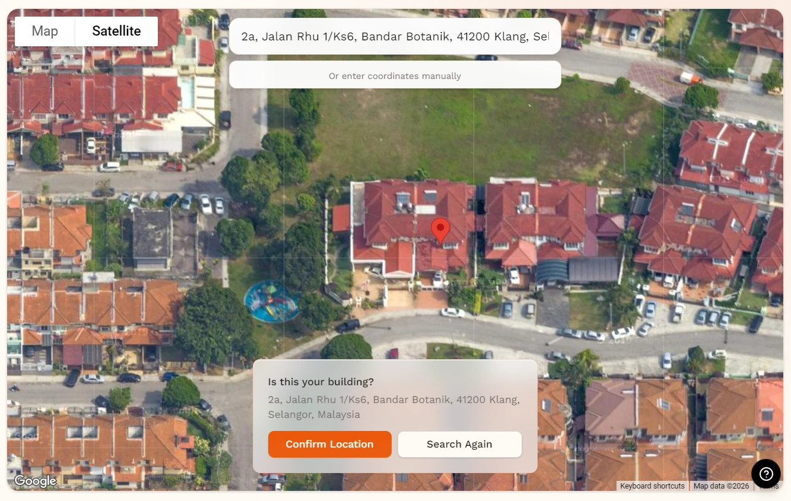
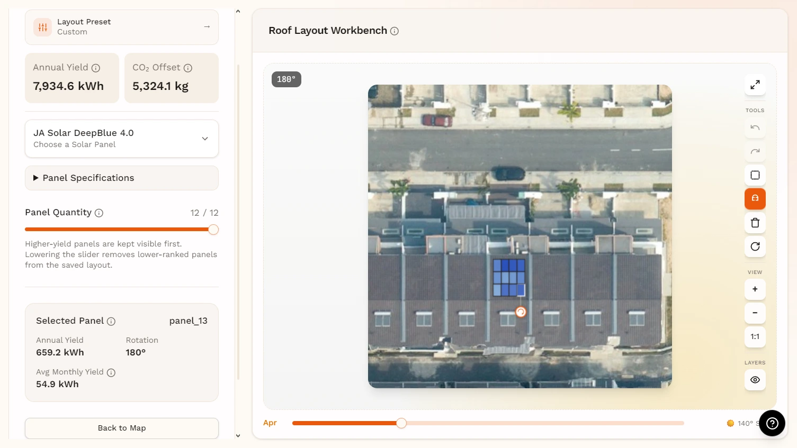
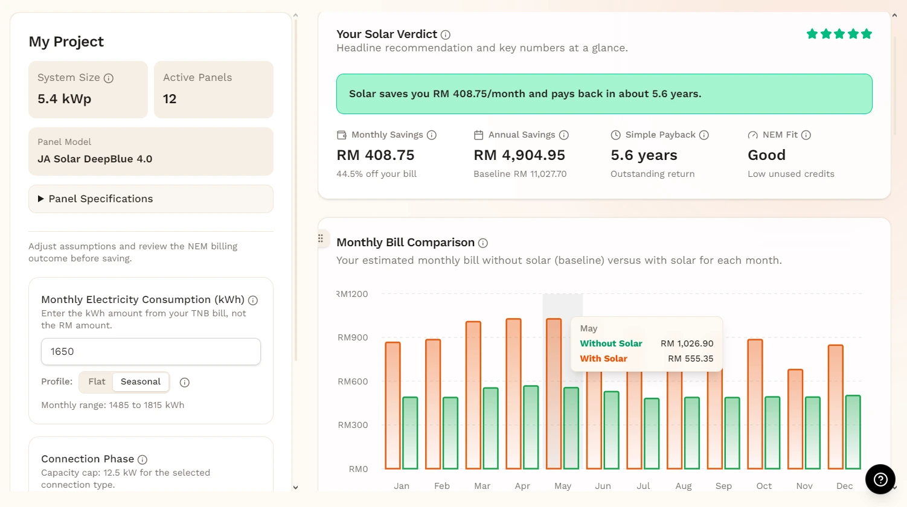
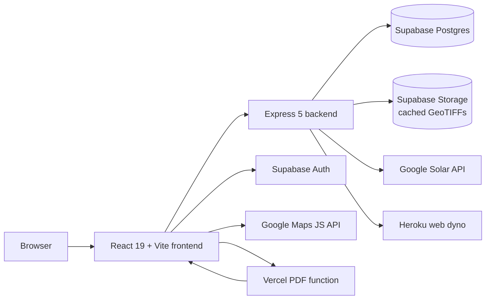
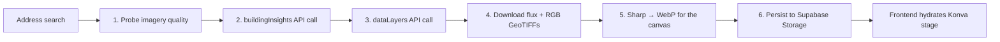
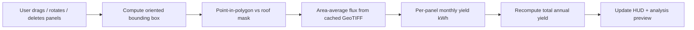
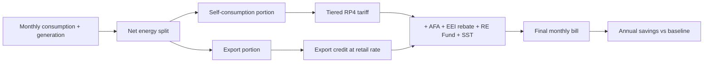

<div align="center">


# SolarSim

### Rooftop solar in three steps, grounded in real Malaysian tariffs.

_Search a roof. Tweak the layout. Get a NEM-accurate savings report. As easy as **A-B-C**._

<br/>

<p>
  
  
  
  
  
  
  
  
  
  
</p>

<p><strong>Aligned with the UN Sustainable Development Goals</strong></p>

<p>
  
</p>

<br/>


</div>

---

> **Final Year Project at Asia Pacific University** · Built by **[@AlaskanTuna](https://github.com/AlaskanTuna)**.

> [!NOTE]
> SolarSim is an **assessment** tool. It produces an estimate report, not a quotation, not a contract, and not an installation order. Final pricing and feasibility always come from a licensed Malaysian installer.

---

## ✨ At a Glance

<table>
  <tr>
    <td align="center"><strong>3 pages</strong><br/><sub>Map → Workbench → Analysis, end to end</sub></td>
    <td align="center"><strong>~90s</strong><br/><sub>average time from address to first savings projection</sub></td>
    <td align="center"><strong>RP4 + EEI + AFA + RE Fund</strong><br/><sub>full TNB tariff stack post-July 2025</sub></td>
  </tr>
</table>

---

## 🖼 Screenshots

<table>
  <tr>
    <td width="33%"><p align="center"><sub><strong>Landing.</strong> <em>Marketing site, pricing, and FAQ.</em></sub></p></td>
    <td width="33%"><p align="center"><sub><strong>Dashboard.</strong> <em>Greeting, quick actions, and recent projects.</em></sub></p></td>
    <td width="33%"><p align="center"><sub><strong>Projects.</strong> <em>Saved projects with status and workflow guide.</em></sub></p></td>
  </tr>
  <tr>
    <td width="33%"><p align="center"><sub><strong>Map.</strong> <em>Search any Malaysian address and lock in the rooftop.</em></sub></p></td>
    <td width="33%"><p align="center"><sub><strong>Workbench.</strong> <em>Drag, rotate, and shape the panel layout.</em></sub></p></td>
    <td width="33%"><p align="center"><sub><strong>Analysis.</strong> <em>NEM bill simulation, payback, and PDF export.</em></sub></p></td>
  </tr>
</table>

---

## 🧠 What SolarSim Does

### The Problem

Malaysian homeowners interested in rooftop solar have limited access to quick, data-driven preliminary assessments. Existing options are either manual on-site surveys (expensive and slow) or generic online calculators that lack roof-specific data. There is no tool that lets users see a proposed panel layout on _their actual rooftop_, interactively adjust it, and immediately understand the financial impact under Malaysia's NEM Rakyat 3.0 scheme.

### Project Objectives

1. **Investigate** rooftop characteristics and solar energy potential using Google Solar API's geospatial data as a basis for reducing reliance on manual assessments.
2. **Design and develop** a web-based tool that auto-generates preliminary panel layouts, enables interactive modification, and incorporates Malaysian tariff and NEM parameters.
3. **Evaluate** the system's usability, accuracy, and effectiveness through user feedback and comparison with existing methods.

### Target Users

| User Type     | Description                                                                    |
| ------------- | ------------------------------------------------------------------------------ |
| **Primary**   | Malaysian homeowners exploring rooftop solar installation                      |
| **Secondary** | Solar installers using the tool for quick preliminary assessments with clients |

User assumptions: non-technical, unfamiliar with solar terminology, accessing via desktop browser (primary) or mobile browser (secondary).

---

## 🏗 Feature Matrix

|     | Feature                       | What it means                                                                                                                                          |
| --- | ----------------------------- | ------------------------------------------------------------------------------------------------------------------------------------------------------ |
| 🛰  | **Solar API Pipeline**        | One Solar API call per address, results cached forever. Building insights, monthly flux, and DSM/RGB GeoTIFFs are persisted in Supabase Storage.       |
| 🖼  | **GeoTIFF Re-sampling**       | Panel moves never re-hit the Solar API. Flux is re-sampled locally from the cached GeoTIFF using point-in-polygon over each panel's rotated OBB.       |
| 🎨  | **Konva Canvas Workbench**    | React-Konva stage with pan, zoom, marquee select, free-rotate, snap-align, undo/redo, and an irradiance-direction amber glow for the chosen month.     |
| 💡  | **Roof-Aware Layout Presets** | Tell SolarSim your monthly bill and savings goal; it right-sizes panel count and orientation. Skippable, so power users get the maximum-coverage view. |
| 💰  | **NEM Rakyat 3.0 Engine**     | Self-consumption + export simulation, EEI banding, AFA monthly variation, SST and RE Fund. Implemented as a typed billing engine with 36 unit tests.   |
| 📈  | **Lifecycle Mode**            | Switch from simple payback to a 25-year lifecycle view: degradation, tariff escalation, scheduled inverter swaps, and annual maintenance.              |
| 🌐  | **i18n (EN / MS / ZH)**       | Three fully-translated locales including all tariff explainers, with locale-aware Intl number/date formatting (`zh-Hans-MY` for the demo audience).    |
| 🎭  | **Theme + A11y**              | Light / dark / system theme persisted via `next-themes`, glassmorphic UI primitives, full keyboard support on the canvas, and visible focus rings.     |
| 📄  | **Sandboxed PDF Export**      | Heroku backend signs a 60-second token; a separate Vercel function navigates a headless Chromium to a print route and ships the A4 landscape PDF.      |
| 🔐  | **Supabase Auth**             | Email/password and Google OAuth, with per-user quota enforcement, project-level RLS, and remember-email on sign-in.                                    |

---

## 🌏 Why It Matters: SDG Alignment

SolarSim is built around one product stance: **Malaysian homeowners should be able to make a data-driven solar decision without first surrendering their phone number to an installer.** That stance maps directly to one UN Sustainable Development Goal:

| SDG                                                                    | Goal                            | How SolarSim contributes                                                                                                                                                                         |
| ---------------------------------------------------------------------- | ------------------------------- | ------------------------------------------------------------------------------------------------------------------------------------------------------------------------------------------------ |
|  | **Affordable and Clean Energy** | Lowering the friction between curiosity and a real solar quotation accelerates household adoption. Every projection cites tariff schedules so the upside number is verifiable, not sales-pitchy. |

---

## 🏛 Architecture

SolarSim is a three-tier monorepo: a **React 19 + Vite SPA**, an **Express 5 + Prisma backend**, and a **Vercel Puppeteer microservice** for PDF rendering. Supabase backs auth, Postgres, and the GeoTIFF object store.



<details>
<summary><strong>Solar Pipeline: Address to Editable Roof</strong></summary>



</details>

<details>
<summary><strong>Workbench Edit Loop: Zero Solar API Calls</strong></summary>



</details>

<details>
<summary><strong>NEM Billing Engine: Per-Month Bill Comparison</strong></summary>



</details>

---

## 🧰 Tech Stack

| Category        | Technology                                                                   | Notes                                                          |
| --------------- | ---------------------------------------------------------------------------- | -------------------------------------------------------------- |
| Frontend        | React 19 · Vite 6 · TypeScript 5 · Tailwind CSS 4 · shadcn/ui · lucide-react | SPA with React Router, TanStack Query, framer-motion           |
| Canvas & 3D     | Konva 9 · react-konva · @react-three/fiber · @react-three/drei               | Workbench stage, snap alignment, panel-model 3D preview        |
| Charts & DnD    | Recharts 3 · @dnd-kit/core · @dnd-kit/sortable                               | Analysis charts, sortable hero card layout                     |
| i18n & Theming  | i18next · react-i18next · next-themes                                        | en / ms / zh, light / dark / system theme                      |
| Backend         | Express 5 · TypeScript 5 · Prisma 6 · Zod                                    | REST API, validators, typed Supabase access                    |
| Geo & Imagery   | geotiff.js · sharp · proj4                                                   | GeoTIFF parsing, raster → WebP, lat-lng ↔ pixel reprojection   |
| Identity & Data | Supabase (Auth + Postgres + Storage)                                         | Email/password + Google OAuth, RLS-backed projects             |
| External APIs   | Google Solar API · Google Maps JavaScript API · Geocoding API                | One Solar call per address, cached forever                     |
| Testing         | Vitest · @testing-library/react · jsdom                                      | Co-located unit tests, 205 passing                             |
| PDF Service     | Vercel function · Puppeteer · Chromium (headless)                            | Sandboxed off the Heroku dyno, signed-token access             |
| Deploy          | Heroku (web dyno) · Vercel (PDF function) · GitHub Actions CI/CD             | `pnpm` build on Heroku via `heroku-postbuild`                  |

---

## 🚀 Getting Started

### Prerequisites

- **Node.js** `24.x`
- **pnpm** `10.33.0` (via `corepack enable`)
- **Supabase project** with Postgres, Auth enabled, and a Storage bucket named `geotiffs`
- **Google Cloud project** with these APIs enabled:
  - Solar API
  - Maps JavaScript API
  - Geocoding API

### Install & configure

```bash
git clone https://github.com/AlaskanTuna/solar-layout-generator.git
cd solar-layout-generator
corepack enable
pnpm install
cp .env.example .env   # then fill in the values below
```

Required environment variables:

| Variable                    | Description                                                         |
| --------------------------- | ------------------------------------------------------------------- |
| `GOOGLE_API_KEY`            | Google Cloud API key with Solar + Maps JS APIs enabled              |
| `GOOGLE_OAUTH_CLIENT_ID`    | Google OAuth 2.0 client ID (for Google sign-in)                     |
| `GOOGLE_OAUTH_SECRET`       | Google OAuth 2.0 client secret                                      |
| `SUPABASE_URL`              | Supabase project URL                                                |
| `SUPABASE_ANON_KEY`         | Supabase anonymous/public key                                       |
| `SUPABASE_SERVICE_ROLE_KEY` | Supabase service-role key (backend only, never ship to the browser) |
| `SUPABASE_DATABASE_URL`     | Direct Postgres connection string (Prisma)                          |
| `FRONTEND_URL`              | Allowed origin for CORS (default `http://localhost:5173`)           |
| `PDF_TOKEN_SECRET`          | 32+ char hex secret for signing PDF export tokens (backend only)    |
| `PDF_EXPORT_URL`            | URL of the deployed Vercel PDF function                             |

### Run locally

```bash
pnpm db:migrate    # apply Prisma migrations
pnpm db:seed       # seed Malaysian tariff configuration
pnpm dev           # frontend on :5173, backend on :3001 concurrently
```

The frontend proxies `/api/*` to the backend in dev.

### Useful commands

| Command             | Description                           |
| ------------------- | ------------------------------------- |
| `pnpm dev`          | Start frontend + backend concurrently |
| `pnpm dev:backend`  | Start backend only                    |
| `pnpm dev:frontend` | Start frontend only                   |
| `pnpm build`        | Build all workspaces for production   |
| `pnpm test`         | Run frontend + backend unit tests     |
| `pnpm typecheck`    | Strict TS check across every package  |
| `pnpm format`       | Run Prettier across the repo          |
| `pnpm db:migrate`   | Run Prisma migrations                 |
| `pnpm db:seed`      | Seed tariff config data               |

---

## ☁ Deployment

The app ships as **two services**: the Heroku web dyno (frontend bundle + Express API) and a separate Vercel function for PDF rendering.

- **Frontend + API (Heroku):** <https://solar-layout-generator-8e2cfa5a38c7.herokuapp.com/>
- **PDF Function (Vercel):** Refer to `PDF Service Deploy` below.

### CI/CD

`.github/workflows/ci-cd.yml` is the source of truth:

- Pull requests run `pnpm install`, build, and unit tests.
- Pushes to `main` re-run CI, then deploy the passing commit to Heroku via the Heroku Git endpoint.
- Heroku detects `pnpm-lock.yaml`, installs the pinned pnpm version from `packageManager`, and runs `heroku-postbuild` (`pnpm build`).

Required GitHub repo secrets:

- `HEROKU_API_KEY`
- `HEROKU_APP_NAME`

### PDF Service Deploy

```bash
cd services/pdf-service
vercel                                       # interactive first-time link
vercel env add ALLOWED_FRONTEND_ORIGIN       # the Heroku origin
vercel --prod                                # production deploy
```

Then set `PDF_EXPORT_URL` (Heroku config var) and `ALLOWED_FRONTEND_ORIGIN` (Vercel) accordingly. SSRF guard on the Vercel side rejects any other origin.

> [!IMPORTANT]
> If the live URLs or commands drift, the `Procfile`, `heroku-postbuild`, and `.github/workflows/ci-cd.yml` are the source of truth, not this README.

---

## 🔒 Privacy & Safety

> [!CAUTION]
> All figures in SolarSim are **estimates** based on satellite-derived flux data. Real-world generation and savings can differ by 10 to 15 percent or more depending on shading, soiling, inverter behaviour, and weather variance not captured in the input data.

- 🧾 **Tariff Provenance.** Every kWh figure traces back to gazetted Suruhanjaya Tenaga and TNB schedules. RP4 brackets, EEI bands, AFA, SST, and the RE Fund are seeded as typed config, not narrated by an LLM.
- 🛰 **Imagery Scope.** Rooftop imagery and flux rasters come exclusively from the Google Solar API and stay scoped to the user's project. SolarSim does not scrape, syndicate, or republish any third-party data.
- ⚖ **Layout Boundary.** The Workbench plans where panels could go, not whether they should. Purlin spacing, MCB sizing, inverter placement, and roof-load calculations are out of scope and remain the installer's responsibility.
- 🔑 **Data Ownership.** Supabase Row-Level Security scopes every project to its owner. Account deletion cascades and removes the user's projects, cached imagery, and saved analyses.
- 🛡 **PDF Token Security.** PDF exports use signed tokens that expire in 60 seconds and are scoped to a single project, so leaked URLs cannot be replayed by anyone else.

---

## 👤 Developer

<table align="center">
  <tr>
    <td align="center" width="220">
      <a href="https://github.com/AlaskanTuna"></a><br/>
      <strong>Adam</strong><br/>
      <a href="https://github.com/AlaskanTuna"><sub>@AlaskanTuna</sub></a><br/>
    </td>
  </tr>
</table>

---

## 📁 Project Structure

<details>
<summary><strong>Repository Layout</strong></summary>

```text
solar-layout-generator/
├── assets/                     # README screenshots and brand art
├── shared/                     # Shared TypeScript types (consumed by both sides)
├── frontend/                   # React 19 + Vite SPA
│   ├── public/                 #   Logos, landing hero, dashboard art, favicons
│   └── src/
│       ├── api/                #   Typed REST client (locations, projects, quota, tariff)
│       ├── components/         #   shadcn/ui, layout, workbench, analysis, pdf, dashboard
│       ├── hooks/              #   React hooks (auth, panels, workbench data, undo/redo)
│       ├── lib/                #   Billing engine, canvas transforms, snap-alignment, i18n
│       ├── locales/            #   en / ms / zh translation namespaces
│       └── pages/              #   Route page components (3-page MVP + dashboard suite)
├── backend/                    # Express 5 + Prisma API
│   └── src/
│       ├── config/             #   Env, Prisma, Supabase clients
│       ├── geo/                #   Coordinate transforms, flux sampler, OBB geometry
│       ├── middleware/         #   Auth, validation, rate-limit, error handler
│       ├── routes/             #   /locations, /projects, /tariff, /quota, /health
│       ├── services/           #   Solar API pipeline, location service, PDF token signer
│       └── app.ts              #   Express app composition
├── services/
│   └── pdf-service/            # Standalone Vercel + Puppeteer PDF function
├── prisma/
│   ├── schema.prisma           # Postgres schema (Location, Project, TariffConfig, Quota)
│   └── seed.ts                 # Seeds RP4 + EEI + AFA + RE Fund tariff defaults
├── supabase/
│   ├── config.toml             # Supabase project config (auth, email, OAuth)
│   └── templates/              # Branded auth email templates (en + ms + zh)
├── tests/
│   └── smoke/                  # Bash smoke tests (auth-z, end-to-end deploys)
├── .github/workflows/          # ci-cd.yml: CI + Heroku auto-deploy
├── package.json                # Root workspace orchestrator
├── pnpm-workspace.yaml
└── .env.example
```

</details>

---

<div align="center">

<sub><strong>SolarSim</strong> · © 2026 Adam ([@AlaskanTuna](https://github.com/AlaskanTuna))</sub>

</div>
